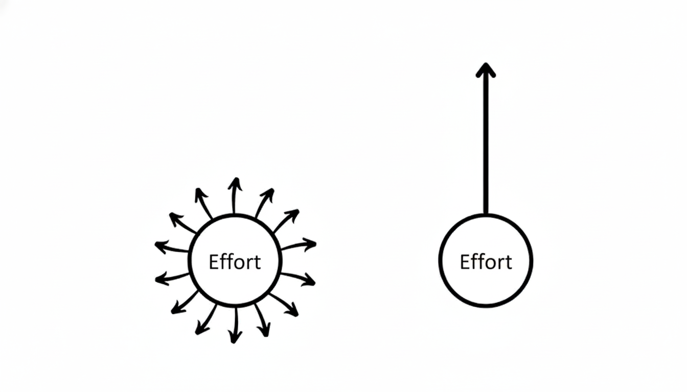

### The Problem I Was Facing

As an early-career engineer with 2.5 years of experience, I felt overwhelmed by the sheer number of subjects demanding my attention. AI? Software Engineering? Data Engineering? System Design? DSA? I felt lost and lacked a clear direction to achieve my goals efficiently and with quality.

I also struggled with integrating AI tools into my workflow. How much should I delegate to AI, and how much should I do myself? After watching some insightful videos from seasoned engineers in late February 2026, I finally reached a conclusion. This post outlines my new strategy.

### References for Further Context

- **NeuralNine:** [I Started A Coding Habit & You Should Too...](https://www.youtube.com/watch?v=3pWXbXjRdQE)
    
### What Was I Doing Wrong?

- **Lack of Completion:** I would start new certifications without finishing the previous ones.
    
- **The "Deep Dive" Trap:** I tried to learn complex topics as fast as possible, only to end up frustrated because deep comprehension takes time.
    
- **The "First Circle" Effect:** I felt like I was shooting in multiple directions at once like the right circle, resulting in zero net progression.

    
- **"Vibe Coding" Dependency:** I was treating AI like a commodity rather than a tool. By passing business rules to an LLM and letting it implement everything, I wasn't actually learning. It felt like I was just handing off problems to a better engineer instead of growing myself.
    
**In summary, the key points I needed to address this year were:**

1. Stop trying to learn everything at once.
    
2. Take full ownership of the code in my projects.
    
3. Focus on shipping: Real knowledge is gained in production.
    
---

### My 2026 Growth Plan

Inspired by **NeuralNine's** framework on building a daily coding habit, I have developed my own weekly routine. I encourage you to analyze your current situation and find ways to optimize your own knowledge gains.

#### My Weekly Routine:

- **Daily Consistency:** Push at least one commit to a personal project every day.
    
- **Project-Based Learning:** Start and finish one small personal project every week.
    
- **Structured Education:** Pursue one certification at a time (currently: _Data Engineering_ by DeepLearning.AI via Coursera) and finish it within four months.
    
- **Documentation:** Document everything I learn in a weekly blog post—starting with this one.
    
- **AI as an Engineering Manager:** Use AI to help brainstorm solutions, debate trade-offs, and compare architectures, rather than just writing the code for me.
    
#### My Framework in Practice:

1. **Idea Phase:** Use Gemini (Engineering Manager mode) to scratch out ideas, find possible solutions, and debate trade-offs.
    
2. **Architecture Phase:** Use Gemini (Software Engineer mode) to understand implementation details and—most importantly—understand the solution line-by-line.
    
3. **Execution Phase:** Code the project manually. If I get stuck, use an IDE assistant to help debug while I focus on understanding the "why" behind the fix.